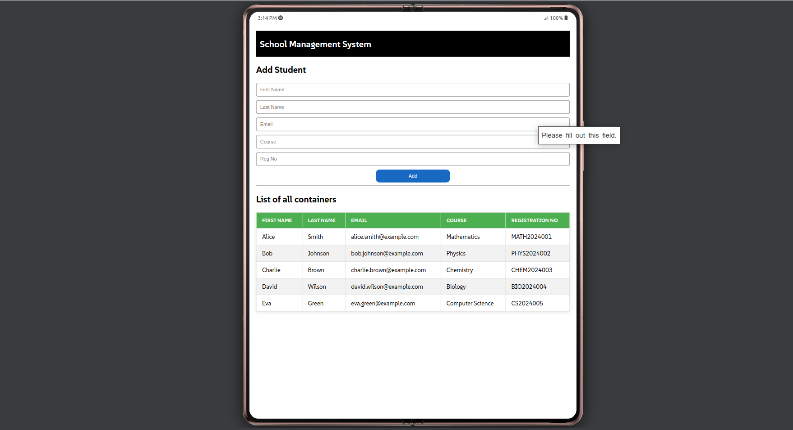

# Student Management System

A simple student management system built with Node.js, Express, MongoDB and HTML, CSS and JavaScript for the frontend. This project allows users to add students to a database and display all students in a table format.

## Features

- Add new students with details like First Name, Last Name, Email, Course and Registration Number.
- Fetch all students from the MongoDB database and display them in table.

## Technologies Used

- **Backend**: Node.js, Express, MongoDB
- **Frontend**: HTML, CSS, JavaScript
- **Database**: MongoDB
